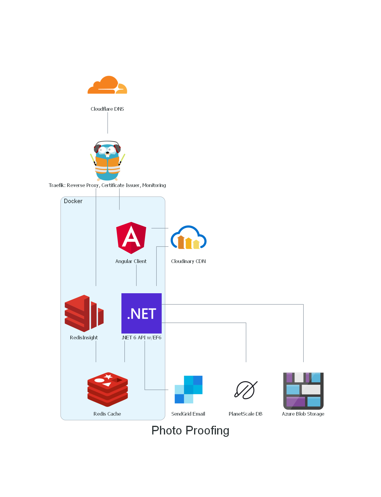

<!-- PROJECT LOGO -->
   
    

    
  </a>
  <a href="photoproofing.it">
    <h1 align="center">Photo Proofing</h1>
  </a>
  

    Full-stack web app to manage the Proofing for my photography hobby.
  

  

    Proofing is the process in which a user chooses the photos they want edited and shipped by the photographer.
  

## Table of contents

- [Table of contents](#table-of-contents)
- [About the project](#about-the-project)
- [Infrastructure Overview]()
- [Used in this project](#used-in-this-project)
  - [Cloudflare](#cloudflare)
  - [Traefik](#traefik)
  - [Angular](#angular)
  - [.NET](#net)
  - [PlanetScale](#planetscale)
  - [Redis](#redis)
  - [RedisInsight](#redisinsight)
  - [Cloudinary](#cloudinary)
  - [SendGrid](#sendgrid)
  - [Storage](#storage)
- [Diagram](#diagram)
- [License](#license)
- [Contributors](#contributors)

# About The Project

I looked for quite some time for a web app that did what i needed (not much) the way i wanted but i could not find one (either they were expensive or they didn't have the features i was looking for), so i decided to do it myself, as an exercise to improve my skills and as a way to build a portfolio i can show when i get asked "what can you do?".

You will find no code as of right now in this repo (other than a small python script for the diagram), i will upload it as soon as everything is ready and tested.

# Infrastructure Overview

Just a cool diagram that illustrates the complete infrastructure used in Photo Proofing.

# Used in this project

## Cloudflare

We all know and love Cloudflare: powerful, easy to use and full of rich (and free) features.

## Traefik

[Traefik](https://traefik.io/) is a new tool i'm learning, it's a *Cloud-Native Networking Stack That Just Works..*. What does that mean? It acts as a reverse proxy, load balancer, certificate issuer (via Let's Encrypt) and generally as a way to keep microservices at bay (they're fun but a hell to manage). It can be used on most of your favourite cloud providers on on-premise, which is what i did, it runs in a Docker container.

## Angular

Angular is my favourite frontend framework, i use it every day and i like the way the projects are organized so my choice for the frontend was pretty easy. React was the second choice, it would have been a great choice but i wanted to improve my Angular skills before switching to another framework (even though i had used it before).

## .NET

.NET is my backend language of choice, it's fast, easy to use and has a great community. I used the .NET 6 framework (the latest LTS version). The API is fully asynchronous and easy to understand (i hope). I used the latest version of Entity Framework (code-first approach) together with LINQ to manage the Database i choose (Planetscale).

## PlanetScale

PlanetScale is a MYSQL-compatible serverless database platform (what a mouthful), it's built on Vitess which is a database clustering system that allows horizontal scaling of MYSQL (horizontal = more, vertical = more powerful), it has very cool features like:
- Branching, which allows for 100% online schema changes that are deployed as you would with a normal CI/CD pipeline.
- Horizontal Sharding: it's extremely scalable via the power of Vitess.

I also choose it beacuse it has a free tier, which is incredibile for the features it provides. 

## Redis

What not throw a cache in there right? Redis is the most popular in-memory data store, you can find it in basically every cloud provider (AWS has Elasticache, Azure has Azure Cache for Redis and so on), i decide to host it myself, it lives in a Docker container and has persistence strategy, if the container ever goes down (which it will), you won't lose any data, pretty cool.

## RedisInsight

Redis is a Redis GUI provided by Redis, it has cool feature like real time monitoring of used memory and so on, a CLI, and Redis modules,it's pretty cool. Guess what, it's hosted in a Docker container.

## Cloudinary

Cloudinary is the CDN i choose to use, mainly because it has a free tier which is more than enough for what i need. It also provides image resizing, ML features such as background removal, cropping ans so on. I only used it for the CDN part.

## SendGrid

SendGrid is a cloud-based SMTP service provider which let you use their email server to send your emails, you get 100 emails a day on the free tier, more than enough for playing around. The paid tiers are also very honest in terms of pricing. I used it to send credentials, confirmations and so on to my users, pretty basic stuff.

Why the heck would I use SendGrid? Well in a cloud environment you usually cannot send email via STMP in a simple way, also who wants to manage an email server?

SendGrid offers an [C# SDK](https://github.com/sendgrid/sendgrid-csharp) to send emails with a few lines of code, I used more lines of code to setup the environment than to send the actual email.

## Storage

Everyone needs a storage right? I choose Azure Blob Storage as that is what i'm familiar with.

# License

Distributed under the GPL License. See `LICENSE` for more information.

Icons made by <a href="https://www.flaticon.com/authors/smashicons" title="Smashicons">Smashicons</a> from <a href="https://www.flaticon.com/" title="Flaticon">www.flaticon.com</a>

# Contributors

[Mattia Ricci](https://mattiaricci.it)
